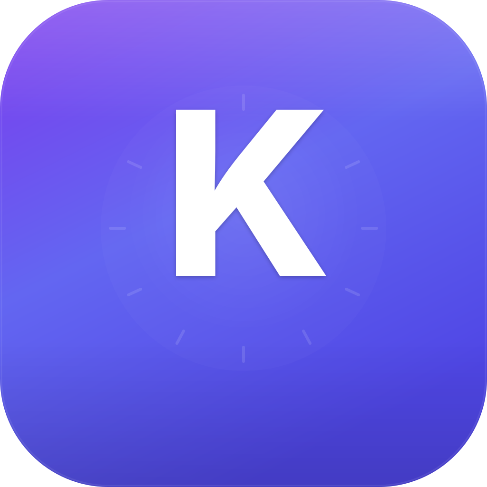

# Koda

Personal day planner with time-block calendar. Desktop app for macOS.

> Plan your day with visual time blocks. Stay focused with countdown timers, native notifications and a tray-icon mini view. Build streaks with daily reviews.



---

## 📥 Install (for friends)

The latest pre-built `.dmg` is in the [Releases](https://github.com/klaschukk/koda/releases) tab.

1. Download the file matching your Mac:
   - **Apple Silicon** (M1/M2/M3/M4) → `Koda-0.1.0-arm64.dmg`
   - **Intel Mac** → `Koda-0.1.0.dmg`
2. Open the `.dmg` and drag **Koda** into Applications
3. First time you launch it, macOS will warn "from an unidentified developer". Right-click the Koda icon → **Open** → confirm. Only needed once.
4. Done. The app lives in the menubar (top-right of the screen) — click to see your current block.

---

## ✨ Features

**Planning**
- Visual timeline (07:00–23:00 by default, configurable)
- Drag-to-create, drag-to-move, resize blocks
- Parallel blocks — overlapping tasks render side-by-side as columns
- 10 default categories with custom icons + colors, full CRUD
- Templates (with **Ideal Day** pre-loaded — load any day in one click)

**Focus**
- Pomodoro mode synced with current block
- Block timer — track real time spent vs planned
- Smart notifications — block start, ending soon (5 min), overtime, idle
- Custom sound packs (bell / chime / click)

**Review & Insights**
- Day Review with animated score card and streak tracking
- Daily Goal progress (configurable hours)
- Stats: heatmap, weekly trend, energy map, category breakdown
- Day notes — freeform daily journal

**Power features**
- Search across all blocks (⌘F)
- Undo / Redo (⌘Z / ⌘⇧Z)
- Multi-select (⌘+click, shift+click)
- Backup / Restore (JSON export with merge or overwrite)

**macOS native**
- Tray icon with live label (shows current block + remaining time)
- Tray popup window with day overview
- Native menu (File / Edit / View / Window / Help)
- Auto-launch at login
- Dock badge with remaining blocks count
- Light / Dark theme synced with system

**Reliability**
- ErrorBoundary with crash recovery
- Atomic file writes (no data loss on power cut)
- Auto-quarantine of corrupted files (app keeps booting)
- Window position / size persistence
- Offline-first — your data never leaves your machine

---

## ⌨️ Keyboard Shortcuts

| Key | Action |
|-----|--------|
| ⌘K / ⌘N | Quick Add Block |
| ⌘R | Review Day |
| ⌘F | Search Blocks |
| ⌘Z / ⌘⇧Z | Undo / Redo |
| ⌘1–4 | Switch pages (Dashboard / Planner / Calendar / Stats) |
| ⌘, | Settings |
| T | Jump to Today |
| ← → | Previous / Next Day |
| D | Mark current block done |
| ? | Show all shortcuts |
| Esc | Close modal |
| ⌘⌥K | Global Quick Add (works from anywhere) |

---

## 💾 Where is my data?

Koda stores everything locally as JSON files at:
```
~/Library/Application Support/koda/koda-data/
├── settings.json          ← preferences, categories, templates, streak
├── days/
│   ├── 2026-04-01.json   ← one file per day
│   ├── 2026-04-02.json
│   └── …
├── window-state.json
└── corrupted/             ← auto-quarantined bad files (safe to delete)
```

**Backup**: Settings → Data → Export Data. Save the JSON somewhere safe (iCloud Drive folder works fine).

**Sync between Macs**: There's no built-in cloud sync. Easiest workaround — symlink the data folder into iCloud Drive. Both Macs will see the same data.

**If something breaks**: Open the data folder (Settings → Data → Open) and look for `corrupted/`. Files there couldn't be parsed but kept around for manual recovery.

---

## 🛠️ Develop

```bash
git clone https://github.com/klaschukk/koda.git
cd koda
npm install
npm run dev          # Vite + Electron with hot reload (port 5174)
```

### Build a fresh DMG

```bash
npm run package:mac  # builds Koda-0.1.0.dmg + Koda-0.1.0-arm64.dmg in release/
```

> macOS DMG is **not code-signed**. To distribute without the "unidentified developer" warning, set up an Apple Developer account ($99/year) and configure signing in `electron-builder.json`. For personal use it's fine — right-click → Open → confirm.

### Tech stack

Electron 29 · React 19 · TypeScript 5 · Vite 5 · Tailwind 3 · Lucide React · Inter + JetBrains Mono.

See [CLAUDE.md](./CLAUDE.md) for architecture details (intended for AI assistants but humans can read too).

---

## 📝 License

MIT — see [LICENSE](./LICENSE).
